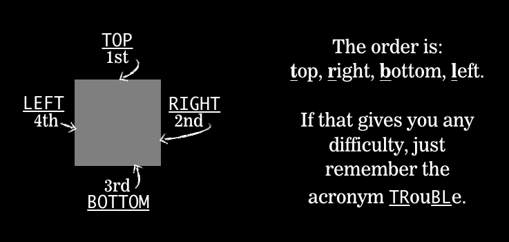

**WDI Fundamentals Unit 4**
---

# The Box Model

Now that we understand how to differentiate between inline and block elements, let's take a look at the CSS Box Model. Every HTML element on a web page is contained in a box, therefore, each comprises:
* The **content** within the box.
* The **padding**, or the area outside of the content.
* The **border**, or the line between the padding and the margin.
* The **margin**, or the area outside of the border that separates the element from other elements on the page.

<div class="wistia_responsive_padding" style="padding:56.25% 0 0 0;position:relative;"><div class="wistia_responsive_wrapper" style="height:100%;left:0;position:absolute;top:0;width:100%;"><iframe src="//fast.wistia.net/embed/iframe/4o0byeriss?seo=false&videoFoam=true" allowtransparency="true" frameborder="0" scrolling="no" class="wistia_embed" name="wistia_embed" allowfullscreen mozallowfullscreen webkitallowfullscreen oallowfullscreen msallowfullscreen width="100%" height="100%"></iframe></div></div>
<script src="//fast.wistia.net/assets/external/E-v1.js" async></script>


#### More on the Box Model

In the video above, we mainly discussed how to set shorthand properties for padding values that are the same. However, there will be many cases in which you'll want to set properties that have different values. Here's what the syntax would look like for setting different padding values for each side of an HTML element:

```html
div {
	background: #c0dec5;
	padding: 2em 3em 0 3em;
}
```

This codes means the top padding will be 2em, the right padding will be 3em, the bottom padding will be 0, and the left padding will be 3em. The diagram below can help you visualize how this works.

.

There will also be instances in which you want to set the same value for your left and right padding or margins and another value for your top and bottom padding or margins. For example, to set your *top and bottom* padding to 0 and your *left and right* padding to 20% of an em, you would use this syntax:

```html
div {
	padding: 0 .2em;
}
```

#### Checkpoint
* How would you set a solid border of red that is 4px for a `p` element?
* How would you center a wrapper for your website?

#### Further Reading
* Learn more about CSS shorthand on the [Mozilla Developer Network](https://developer.mozilla.org/en-US/docs/Web/CSS/Shorthand_properties).

---


[Ready to try it out yourself?](04_exercise.md)
